  

   

  
  

 

## About me

I'm Renato, a **Software Development student** from Rio Grande do Sul, Brazil. I'm currently growing my skills in **C#, .NET and web development**, learning by building and understanding how software works beyond the surface.

Alongside my studies, I build and deliver **RedM and FiveM systems through SafeStudio**, giving me hands-on experience with real projects, interfaces, gameplay systems, integrations and practical problem-solving.

 

  

 

## What I'm working on

<table>
<tr>
<td width="33%" valign="top">

#### 01 — Learning & Improving

Strengthening my foundations in **C#**, **.NET**, OOP and software development with a focus on clean and maintainable code.

`C#` `.NET` `OOP`

</td>
<td width="33%" valign="top">

#### 02 — Web Development

Building modern interfaces and improving my frontend workflow with component-based and typed technologies.

`React` `TypeScript` `Tailwind`

</td>
<td width="33%" valign="top">

#### 03 — SafeStudio

Developing and delivering systems for **RedM** and **FiveM**, from gameplay resources to interfaces and framework integrations.

`Lua` `RedM` `FiveM`

</td>
</tr>
</table>

 

## Featured work

 

## Developer activity

  

 

## Most used languages

  

 

---

  📍 Rio Grande do Sul, Brazil
    
  <strong>Building. Learning. Improving.</strong>

