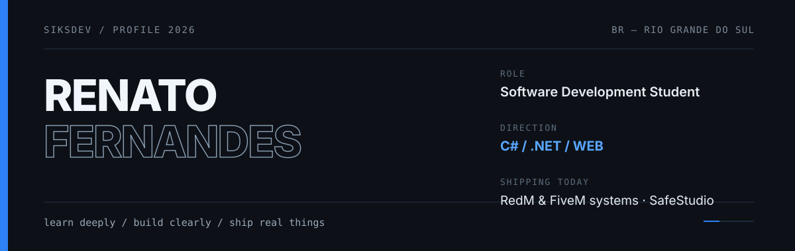
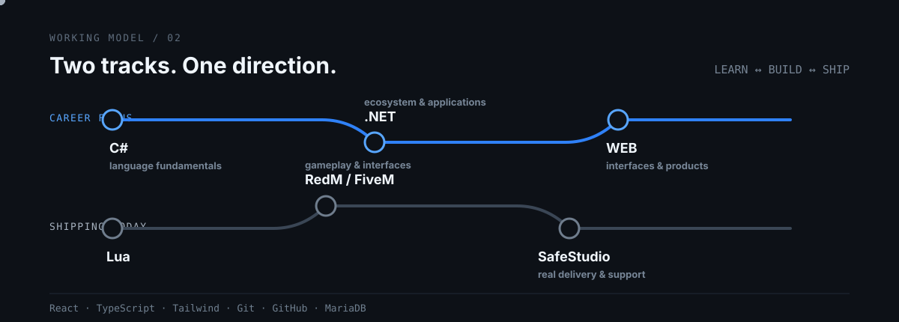

  

  <a href="https://www.linkedin.com/in/renatoofernandes/"><b>LinkedIn</b></a>
  &nbsp;&nbsp;/&nbsp;&nbsp;
  <a href="https://discord.gg/bDWvGZuSRS"><b>SafeStudio</b></a>
  &nbsp;&nbsp;/&nbsp;&nbsp;
  <a href="https://github.com/siksdev/Safe-Pointing"><b>Safe Pointing</b></a>

 

## About

I'm Renato, an **Analysis and Systems Development student** from Rio Grande do Sul, Brazil.

I'm building my professional path around **C#, .NET and web development**. In parallel, I already ship real **RedM and FiveM systems through SafeStudio** — working across gameplay, interfaces, integrations and the practical problems that only show up once software is actually being used.

I care more about understanding why a system works than making a demo look finished.

 

  

 

## Selected work

**Safe Pointing** is a standalone RedM resource that uses camera-based raycasting so the character points where the player is actually looking. It synchronizes the behavior across players through optimized network events and is written in Lua 5.4 with a low CPU footprint.

**[Explore the repository →](https://github.com/siksdev/Safe-Pointing)**

 

---

Based in Rio Grande do Sul, Brazil · currently deepening C# / .NET / web · shipping RedM & FiveM systems through SafeStudio.

